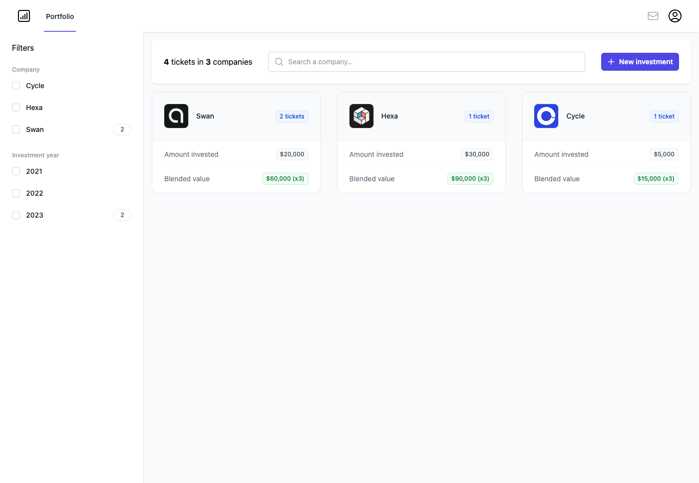
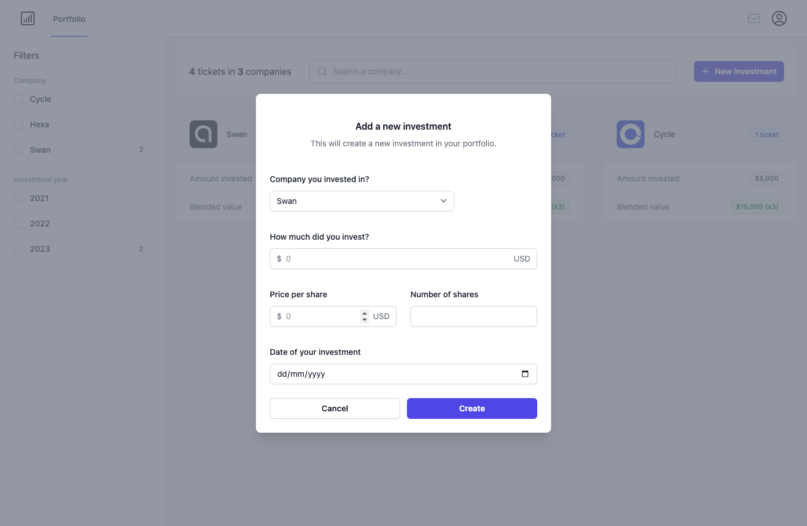
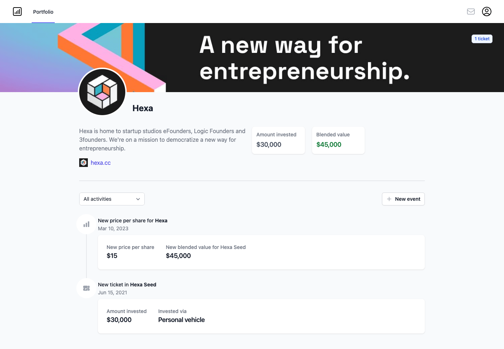
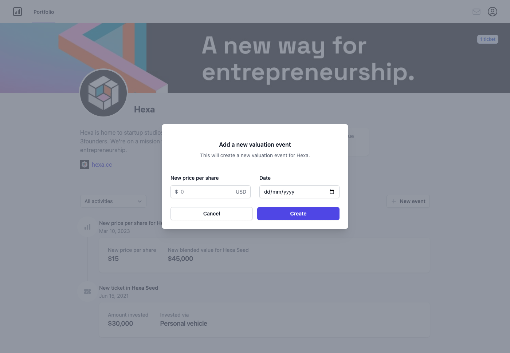

# ZenvestLite Technical Test

ZenvestLite is a simpler version of Zenvest you will develop using modern web technologies (Full-Stack JS​).

In ZenvestLite, you can track your private equity investments in startups and follow your portfolio evolution (reporting & valuation updates).

You can add a new investment in your portfolio as well as update its valuation.

You will use the same stack as Zenvest: TypeScript, Node.js, Prisma, PostgreSQL, React and Next.js.

## 2 user stories:

### User story 1: list of investments with insertion functionality.

- User can see a list of all the companies he invested in along with relevant information. (fields: number of investments, total amount invested and current valuation => sum of underlying investments latest valuation).

- User can create a new investment using a modal dialog. (fields: company => use a list of predefined companies, amount invested, initial valuation => number of shares \* price per share, date of investment).

### User story 2: investment detailed view with valuation updates functionality.

- User can click on a company in the portfolio to access the detailed view of the investments. (route: /portfolio/:id)
- User can see a list of events related to the company: new investments & valuation updates.
- User can add a new valuation event to specify a price per share update.

### Bonus:

- Implement sign-up and login to authenticate users. (they can't have access to the portfolio until signed up and logged in).
- Add filters feature on the list of investments by company and investment year, add another filter on the investment detailed view by event type.

## Getting started

To bootstrap a prototype quickly and keep things simple, you will use [Next.js](https://nextjs.org/) alongside [Prisma](https://www.prisma.io/) to create the backend. You should fork this repository and proceed with implementing the user stories. The database schema is located in prisma/schema.prisma.

You may follow the instructions given [here](https://vercel.com/guides/nextjs-prisma-postgres), you can also check relevant Prisma examples.

You must use [React Server Components](https://nextjs.org/docs/getting-started/react-essentials#server-components) to fetch data from the Prisma ORM and use [React Server Actions](https://nextjs.org/docs/app/building-your-application/data-fetching/server-actions) to mutate your data.

The frontend is already built for you using [TailwindCSS](https://tailwindcss.com/) and you should not need extra components.

It's OK to seed the database with fixture data and recreate it on every app restart for quick prototyping, but you should not need to alter the database schema.

Please provide the reviewer with:

- access to your git repository (atomic commits will be appreciated).
- a summary of what you were able to implement and instructions on how to test it.
- hosting the project is highly appreciated (you may use [Vercel](https://vercel.com/) along with a free Vercel Postgres database).

You should not **spend more than one day** on this project.
Don’t worry if you don’t have time to ship everything: **quality over quantity**, the most important thing is to deliver **something elegant that just works**.

## Evaluation criteria:

- code is logical and easily **understandable** by the reviewer.
- your technical choices **stay aligned with the stack**.
- you're able to deliver **features that incrementally implement user stories**.

## ZenvestLite screenshots

Portfolio view

New investment form

Portfolio company view

New valuation event form
